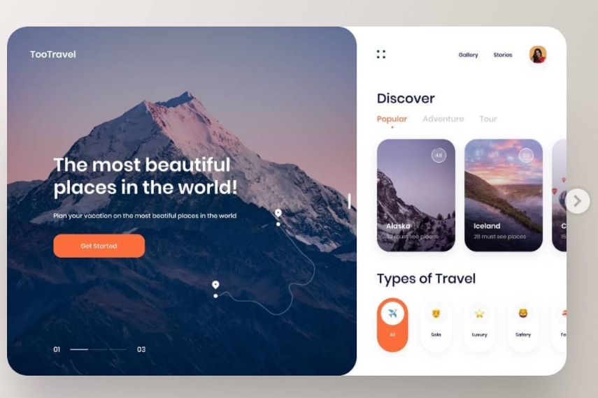
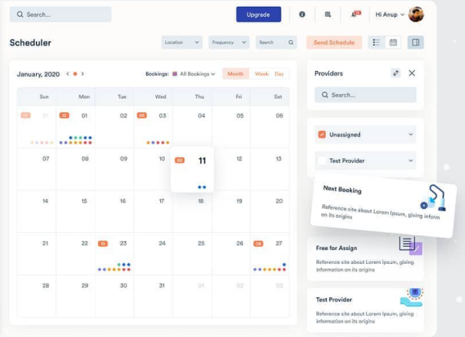

This project is to learn react, material ui and Graphql.

I used create-react-app to setup my project and then install the following libs:

- Material core
- Material ui

- **_I plan on add other libs where necessary for instance the calendar page and notification might need ones._**

Just follow the create-react-app instructions to run this application.

Design inspirations
Explore page

Calender Page

Notification Page
Still looking for inspiration...
